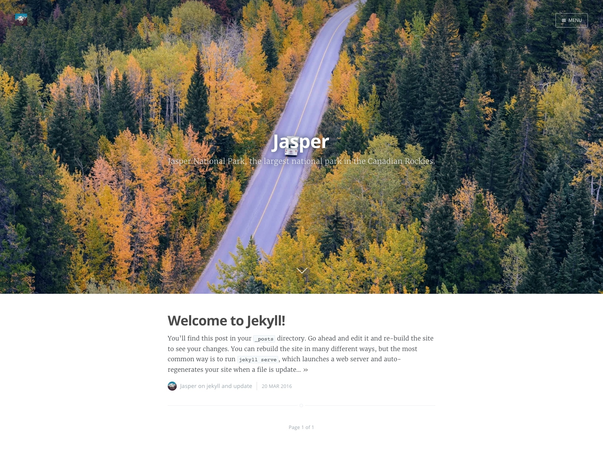

Jekyll port of [Casper](https://github.com/TryGhost/Casper), the [Medium](https://medium.com/)-like [Ghost](https://github.com/TryGhost/Ghost) default's theme.



## Demo

- Home: [http://pym.me/Jasper](http://pym.me/Jasper)
- This very README: [http://pym.me/Jasper/README.html](http://pym.me/Jasper/README.html)

## Features

- [Atom Feed](#atom-feed)
- [Code Snippet Highlighting](#code-snippet-highlighting)
- [Covers](#covers)
- [Navigation](#navigation)
- [Pagination](#pagination)
- [Multiple Authors](#multiple-authors)
  - [Gravatar Integration](#gravatar-integration)
  - [Author Page](#author-page)
- [Disqus Comments](#disqus-comments)
- [Facebook Open Graph](#facebook-open-graph)
- [Twitter Summary Card](#twitter-summary-card)

## Customization

- [Site Cover](#site-cover)
- [Post Covers](#post-covers)
- [Full Config Example](#full-config-example)
- [Add an Author](#add-an-author)

---

## Installation

```bash
$ git clone https://github.com/Pym/Jasper.git
$ bundle install
$ bundle exec jekyll serve
```
Dependency versions :

- jekyll 3.0.3
- jekyll-paginate 1.1.0

Match GitHub Pages as of 03/20/2016.

## Philosophy

Jasper doesn't introduce anything new. It's a DRY port from [Casper](https://github.com/TryGhost/Casper) to [Jekyll/Liquid templates](https://jekyllrb.com/docs/templates/).

The main idea is to mimic Casper as much as possible while dealing with Jekyll's limitations.

Original files from Casper used by Jasper:

```bash
.
 └── assets
    ├── css
    │   └── screen.css
    ├── fonts
    │   ├── casper-icons.eot
    │   ├── casper-icons.svg
    │   ├── casper-icons.ttf
    │   └── casper-icons.woff
    └── js
        ├── index.js
        └── jquery.fitvids.js
```

The only add-on so far is the addition of the GitHub icon – grabbed from [GitHub Octicons](https://octicons.github.com/) – to the `casper-icons` font. This was possible thanks to the [IcoMoon App](https://icomoon.io/app/)!

## Jasper Features

### Atom Feed

Jekyll's default theme has already its RSS 2/Atom [`feed.xml`](https://github.com/jekyll/jekyll/blob/master/lib/site_template/feed.xml), but why are they trying so hard? Atom is just a better format.

Let's KISS with Jasper's [`atom.xml`](https://github.com/Pym/Jasper/blob/gh-pages/atom.xml), based on this [Wikipedia example](https://en.wikipedia.org/wiki/Atom_(standard)#Atom_1.0_and_IETF_standardization).

### Code Snippet Highlighting

Documentation: [Templates - Code Snippet Highlighting (Jekyll)](https://jekyllrb.com/docs/templates/#code-snippet-highlighting)

Made possible with [`_syntax-highlighting.scss`](https://github.com/Pym/Jasper/blob/gh-pages/_sass/_syntax-highlighting.scss) from Jekyll's default theme.

### Covers

Just like the original Casper, you can use [covers](/images/covers/welcome.jpg) easily with Jasper too!

### Navigation

A responsive menu, showing from the right and featuring a subscribe button. Easily configurable in [`_config.yml`](#full-configyml-example) .

### Pagination

Documentation: [Pagination (Jekyll)](https://jekyllrb.com/docs/pagination/)

Customizable pagination system thanks to [jekyll-paginate](https://github.com/jekyll/jekyll-paginate).

#### Limitations

Pagination **only works on the index**. This is a limitation of jekyll-paginate. We could use [octopress-paginate](https://github.com/octopress/paginate) – which is basically a drop in replacement – but it's not part of [GitHub Pages](https://pages.github.com/versions/) yet ([issue on the subject](https://github.com/github/pages-gem/issues/257)).

### Multiple Authors

Thanks to Jekyll [Data Files](https://jekyllrb.com/docs/datafiles/), Jasper let you [add as much authors as you want](#add-an-author)!

#### Gravatar Integration

Your [Gravatar](https://en.gravatar.com/) will be displayed every time your author's name will show up. Choose it wisely!

#### Author Page

A page, with author information – name, bio, pictures and links – listing the author's posts.

The not-so-nice part: you have to [create one page for every author](#create-the-corresponding-author-file).

### Disqus Comments

Documentation: [JavaScript configuration variables (Disqus)](https://help.disqus.com/customer/portal/articles/472098-javascript-configuration-variables)

You must set the `disqus` variable in [`_config.yml`](#full-configyml-example) to turn on that feature.

By default, Disqus comments are visible on every post, you can disable comments for a specific post by adding `disable_comments` and setting it to `true`.

```liquid
---
layout: post
title:  "Welcome to Jekyll!"
categories: jekyll update
author: jasper
disable_comments: true
---
```

### Facebook Open Graph

Documentation: [The Open Graph protocol](http://ogp.me/)

Facebook metas from `header.html`:

<!---

-->
```html
<meta property="og:url" content="{{ page.url | prepend: site.baseurl | prepend: site.url }}" />
<meta property="og:type" content="article" />
<meta property="og:title" content="{{ title }}" />
<meta property="og:description" content="{{ description }}" />
<meta property="og:image" content="" />
```
<!---

-->

### Twitter Summary Card

Documentation: [Summary Card (Twitter)](https://dev.twitter.com/cards/types/summary)

You must set the `twitter` variable in [`_config.yml`](#full-configyml-example) to turn on that feature.

Twitter metas from `header.html`:

<!---

-->
```html

<meta name="twitter:card" content="summary">
<meta name="twitter:site" content="@{{ site.twitter }}">
<meta name="twitter:title" content="{{ title }}">
<meta name="twitter:description" content="{{ description }}">
<meta name="twitter:image" content="">

```
<!---

-->

## Jasper Customization

### Site Cover

To replace the default cover, which only appears on the index, edit `index.html` and modify the `cover` variable:

```liquid
---
layout: default
cover: /images/covers/jasper.jpg
---
```

### Post Covers

Posts can have covers too!

You just have to add the `cover` variable and set it to an image path:

```liquid
---
layout: post
title:  "Welcome to Jekyll!"
categories: jekyll update
author: jasper
cover: /images/covers/welcome.jpg # Header cover [optional]
---
```

### Full Config Example

``` yaml
# _config.yml

# Site settings
title: Jasper
logo: /images/logo.png
description: Jasper National Park, the largest national park in the Canadian Rockies.
baseurl: "/Jasper" # the subpath of your site, e.g. /blog
url: http://pym.me # the base hostname & protocol for your site

# Main header
header:
  text_shadow: 0 0 20px rgba(28, 47, 53, .8) # CSS text-shadow

# Navigation
navigation:
  - slug: /README.html
    label: Jasper

# Services (all are optional)
analytics: UA-1234567-8 # Google Analytics tracking ID
disqus: jasper-theme    # Disqus shortname
facebook_l10n: en_US    # Your locale (en_US, fr_FR, etc.)
twitter: JasperTheme    # Website's Twitter username (without the '@')

# Build settings
exclude: [CNAME, Gemfile, Gemfile.lock]
markdown: kramdown
kramdown:
  input: GFM # Enable GitHub Flavored Markdown

# Plugins
gems: [jekyll-paginate]
paginate: 5 # Post excerpts by page
paginate_path: "/page/:num" # Default was "/page:num/"
```

### Add an Author

This will guide you trough the process of adding an author (or editing the default one).

#### #1 Open `_data/authors.yml` and add your author:

``` yaml
jasper: # Author key. Must be the same as the slug (next line)
  slug: jasper # Must be the same as the author key (previous line) [required]
  name: Jasper # Doesn't need an explanation [required] [views: all]
  bio: Hi! I'm Jasper, a National Park and also a Jekyll theme! # Short bio [optional] [views: post, author]
  location: Alberta, Canada # [optional] [views: post, author]
  twitter: JasperTheme # Twitter username (without the '@') [views: post, author]
  github: Pym/Jasper #GitHub username or username/repository (without any '@'!) [optional] [views: post, author]
  gravatar: 2483fd8c9446700e4dc7c2b26c2dd790 # MD5 hash of your Gravatar email [optional (but it's cool)]
```

#### #2 Generate Gravatar's MD5 Hash

To generate the MD5 hash for your author, run this in your terminal:

``` bash
$ php -r 'echo md5(strtolower(trim("your.author@email.com")));'
```

#### #3 Create the corresponding author file

We **must** name our new author's page the same way. For our example's author, `jasper` is the author key that we defined earlier in `_data/authors.yml`. So in this this case the file will be  `author/jasper.html`:

<!---

-->
```liquid
---
layout: author
title: Jasper's Posts
author: jasper
---


```
<!---

-->

Replace every `Jasper` and `jasper` occurrences with your own author name and slug... and you are done!

## Thanks
- [@parkr](https://github.com/parkr) for making [Jekyll](https://jekyllrb.com/)
- The GitHub Team for making [GitHub Pages](https://pages.github.com/) 💓
- The Ghost Team for making [Casper](https://github.com/TryGhost/Casper)!
- [Tim Gouw](https://unsplash.com/punttim) for the default covers used by Jasper:
  - [https://unsplash.com/photos/MP8gUVg2bMQ](https://unsplash.com/photos/MP8gUVg2bMQ)
  - [https://unsplash.com/photos/_8gWAP_GRzk](https://unsplash.com/photos/_8gWAP_GRzk)

## TODO

- [ ] Category/Tag Page: I don't use those, feel free to work on it if you think it can be usefull! 😄

## Contributing

1. Fork it ([https://github.com/Pym/Jasper/fork](https://github.com/Pym/Jasper/fork))
2. Create your feature branch (`git checkout -b my-new-feature`)
3. Commit your changes (`git commit -am 'Add some feature'`)
4. Push to the branch (`git push origin my-new-feature`)
5. Create a new Pull Request

## License

See the [LICENSE](https://github.com/Pym/Jasper/blob/gh-pages/LICENSE) file.
